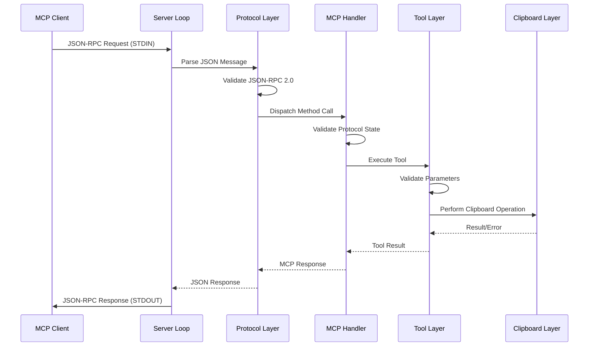
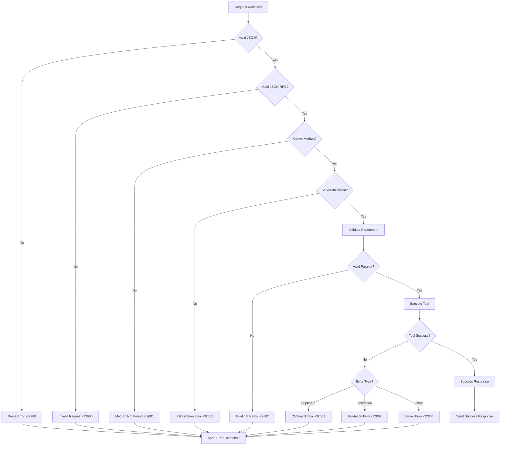

# MCP Clipboard Server - Architecture Documentation

---
Last Updated: 2025-07-16
Version: 1.0.0
Verified Against: Current implementation
Source Files: src/mcp_clipboard_server/
---

## Overview

The MCP Clipboard Server follows a layered architecture with clear separation of concerns, type safety through TypedDict, and comprehensive error handling. The design prioritizes maintainability, cross-platform compatibility, and production reliability.

## High-Level Architecture

```
┌─────────────────────────────────────────────────────────────┐
│                     MCP Client                              │
│                (AI Assistant, IDE, etc.)                   │
└─────────────────────┬───────────────────────────────────────┘
                      │ JSON-RPC 2.0 over STDIO
                      │
┌─────────────────────▼───────────────────────────────────────┐
│                 MCP Clipboard Server                        │
│                                                             │
│  ┌─────────────────────────────────────────────────────┐   │
│  │                CLI Layer                            │   │
│  │  • Signal handling (SIGTERM, SIGINT)               │   │
│  │  • Graceful shutdown coordination                  │   │
│  │  • Environment configuration                       │   │
│  └─────────────────────┬───────────────────────────────┘   │
│                        │                                   │
│  ┌─────────────────────▼───────────────────────────────┐   │
│  │              Server Loop                            │   │
│  │  • STDIO communication management                  │   │
│  │  • Request/response coordination                   │   │
│  │  • Batch request processing                        │   │
│  │  • Error recovery and resilience                   │   │
│  └─────────────────────┬───────────────────────────────┘   │
│                        │                                   │
│  ┌─────────────────────▼───────────────────────────────┐   │
│  │            Protocol Layer                           │   │
│  │  • JSON-RPC 2.0 parsing and validation            │   │
│  │  • Message format handling                         │   │
│  │  • Error response generation                       │   │
│  │  • Batch request decomposition                     │   │
│  └─────────────────────┬───────────────────────────────┘   │
│                        │                                   │
│  ┌─────────────────────▼───────────────────────────────┐   │
│  │              MCP Handler                            │   │
│  │  • Method dispatch (initialize, tools/*)           │   │
│  │  • Protocol compliance enforcement                 │   │
│  │  • JSON Schema validation                          │   │
│  │  • Capability negotiation                          │   │
│  └─────────────────────┬───────────────────────────────┘   │
│                        │                                   │
│  ┌─────────────────────▼───────────────────────────────┐   │
│  │              Tool Layer                             │   │
│  │  • Tool registration and discovery                 │   │
│  │  • Parameter validation against schemas            │   │
│  │  • Result formatting                               │   │
│  │  • Error code mapping                              │   │
│  └─────────────────────┬───────────────────────────────┘   │
│                        │                                   │
│  ┌─────────────────────▼───────────────────────────────┐   │
│  │            Clipboard Layer                          │   │
│  │  • Cross-platform abstraction                      │   │
│  │  • Platform detection and selection                │   │
│  │  • Error handling and fallback logic               │   │
│  │  • Size validation and Unicode support             │   │
│  └─────────────────────┬───────────────────────────────┘   │
└──────────────────────────────────────────────────────────────┘
                         │
┌────────────────────────▼─────────────────────────────────────┐
│              Platform Abstraction                           │
│  ┌─────────────┐ ┌──────────────┐ ┌─────────────────────┐   │
│  │   Windows   │ │    macOS     │ │       Linux         │   │
│  │ win32clipboard│ │  pasteboard  │ │ xclip/xsel/wl-copy │   │
│  │   tkinter   │ │   pbpaste    │ │                     │   │
│  └─────────────┘ └──────────────┘ └─────────────────────┘   │
└──────────────────────────────────────────────────────────────┘
                         │
┌────────────────────────▼─────────────────────────────────────┐
│                 System Clipboard                            │
│            (Operating System Native)                        │
└──────────────────────────────────────────────────────────────┘
```

## Module Architecture

### Public API Modules

#### cli.py
**Purpose**: Command-line interface and application entry point

<!-- SOURCE: src/mcp_clipboard_server/cli.py -->
<!-- VERIFIED: 2025-07-16 -->
```python
class CLIHandler:
    """
    Handles command-line interface and signal management.
    
    Features:
    - Signal handling (SIGTERM, SIGINT)
    - Graceful shutdown coordination
    - Environment variable processing
    - Cross-platform compatibility
    """
```

**Key Responsibilities:**
- Parse command-line arguments
- Configure logging from environment variables
- Set up signal handlers for graceful shutdown
- Coordinate server startup and teardown

#### server.py
**Purpose**: Main server loop and STDIO communication

<!-- SOURCE: src/mcp_clipboard_server/server.py:22-50 -->
<!-- VERIFIED: 2025-07-16 -->
```python
class MCPServer:
    """MCP clipboard server implementation."""

    def __init__(self):
        """Initialize the MCP server."""
        self.mcp_handler = MCPHandler()

    # Expose MCPHandler properties for backwards compatibility with tests
    @property
    def initialized(self):
        """Check if server is initialized."""
        return self.mcp_handler.initialized

    @property
    def server_info(self):
        """Get server info."""
        return self.mcp_handler.get_server_info()

    @property
    def capabilities(self):
        """Get server capabilities."""
        return self.mcp_handler.get_server_capabilities()
```

**Key Responsibilities:**
- Manage STDIO communication loop
- Coordinate with protocol layer for message processing
- Handle server lifecycle events
- Provide compatibility interface for testing

#### protocol.py
**Purpose**: JSON-RPC 2.0 message handling

<!-- SOURCE: src/mcp_clipboard_server/protocol.py -->
<!-- VERIFIED: 2025-07-16 -->
```python
def parse_json_rpc_message(line: str) -> Union[JsonRpcRequest, List[JsonRpcRequest]]:
    """
    Parse JSON-RPC message from input line.
    
    Handles both single requests and batch requests according to JSON-RPC 2.0.
    """

def create_batch_response(responses: List[str]) -> str:
    """
    Create a JSON-RPC batch response.
    
    Args:
        responses: List of individual JSON response strings.
    """
```

**Key Responsibilities:**
- Parse and validate JSON-RPC 2.0 messages
- Handle single and batch requests
- Generate properly formatted responses
- Manage JSON serialization/deserialization

#### tools.py
**Purpose**: Tool implementation and execution

<!-- SOURCE: src/mcp_clipboard_server/tools.py:20-28 -->
<!-- VERIFIED: 2025-07-16 -->
```python
def list_tools() -> Dict[str, Any]:
    """
    Return the list of available tools for MCP tools/list request.

    Returns:
        Dict containing the tools array.
    """
    tool_definitions = get_all_tool_definitions()
    return {"tools": list(tool_definitions.values())}
```

**Key Responsibilities:**
- Implement MCP tool interface
- Validate tool parameters against schemas
- Execute clipboard operations
- Format tool results according to MCP specification

#### clipboard.py
**Purpose**: Cross-platform clipboard abstraction

<!-- SOURCE: src/mcp_clipboard_server/clipboard.py -->
<!-- VERIFIED: 2025-07-16 -->
```python
class ClipboardError(Exception):
    """Custom exception for clipboard operations."""

def get_clipboard() -> str:
    """Get current clipboard content."""

def set_clipboard(text: str) -> None:
    """Set clipboard content."""
```

**Key Responsibilities:**
- Abstract platform-specific clipboard operations
- Provide unified interface for clipboard access
- Handle platform detection and fallback logic
- Manage Unicode and size validation

### Private Implementation Modules

#### _mcp_handler.py
**Purpose**: Core MCP protocol implementation

<!-- SOURCE: src/mcp_clipboard_server/_mcp_handler.py -->
<!-- VERIFIED: 2025-07-16 -->
```python
class MCPHandler:
    """
    Core MCP protocol implementation.
    
    Handles method dispatch, schema validation, and protocol compliance.
    """
```

**Key Responsibilities:**
- Dispatch MCP method calls
- Enforce protocol compliance
- Manage server initialization state
- Coordinate with tool layer

#### _protocol_types.py
**Purpose**: Type-safe protocol data structures

<!-- SOURCE: src/mcp_clipboard_server/_protocol_types.py:14-40 -->
<!-- VERIFIED: 2025-07-16 -->
```python
# Basic types
JsonRpcId = Union[str, int, None]

class ClientInfo(TypedDict, total=False):
    """Client information provided during initialization."""
    name: str
    version: str

class InitializeParams(TypedDict, total=False):
    """Parameters for initialize request."""
    protocolVersion: str
    clientInfo: ClientInfo

class ServerInfo(TypedDict):
    """Server information returned during initialization."""
    name: str
    version: str
```

**Key Responsibilities:**
- Define TypedDict structures for all MCP data types
- Ensure type safety throughout the application
- Provide IDE support and documentation
- Maintain protocol version compatibility

#### _tool_schemas.py
**Purpose**: JSON Schema definitions for tools

<!-- SOURCE: src/mcp_clipboard_server/_tool_schemas.py:8-41 -->
<!-- VERIFIED: 2025-07-16 -->
```python
# Schema for get_clipboard tool (no parameters)
GET_CLIPBOARD_SCHEMA: ToolInputSchema = {
    "type": "object",
    "properties": {},
    "required": [],
    "additionalProperties": False,
}

# Schema for set_clipboard tool
SET_CLIPBOARD_SCHEMA: ToolInputSchema = {
    "type": "object",
    "properties": {
        "text": {
            "type": "string",
            "description": "The text content to copy to the clipboard",
            "maxLength": 1048576,  # 1MB limit
        }
    },
    "required": ["text"],
    "additionalProperties": False,
}

# Complete tool definitions with schemas
TOOL_DEFINITIONS: Dict[str, ToolDefinition] = {
    "get_clipboard": {
        "name": "get_clipboard",
        "description": "Get the current text content from the system clipboard",
        "inputSchema": GET_CLIPBOARD_SCHEMA,
    },
    "set_clipboard": {
        "name": "set_clipboard",
        "description": "Set the system clipboard to the provided text content",
        "inputSchema": SET_CLIPBOARD_SCHEMA,
    },
}
```

**Key Responsibilities:**
- Define JSON schemas for all tool parameters
- Serve as single source of truth for tool definitions
- Support comprehensive parameter validation
- Enable automatic documentation generation

#### _errors.py
**Purpose**: Centralized error handling

<!-- SOURCE: src/mcp_clipboard_server/_errors.py:17-74 -->
<!-- VERIFIED: 2025-07-16 -->
```python
class ErrorCodes:  # pylint: disable=too-few-public-methods
    """JSON-RPC 2.0 and MCP-specific error codes."""

    PARSE_ERROR = -32700
    INVALID_REQUEST = -32600
    METHOD_NOT_FOUND = -32601
    INVALID_PARAMS = -32602
    INTERNAL_ERROR = -32603
    SERVER_ERROR = -32000
    CLIPBOARD_ERROR = -32001

# Exception to error code mapping
EXCEPTION_TO_ERROR_CODE: Dict[
    Type[Exception], Union[int, Callable[[Exception], int]]
] = {
    ValueError: MCPErrorCodes.INVALID_PARAMS,
    ValidationException: MCPErrorCodes.INVALID_PARAMS,
    ClipboardError: MCPErrorCodes.CLIPBOARD_ERROR,
    TypeError: MCPErrorCodes.INVALID_PARAMS,
    KeyError: MCPErrorCodes.INVALID_PARAMS,
    AttributeError: MCPErrorCodes.INTERNAL_ERROR,
    RuntimeError: MCPErrorCodes.SERVER_ERROR,
}
```

**Key Responsibilities:**
- Define standardized error codes and messages
- Map exceptions to appropriate JSON-RPC error codes
- Generate consistent error responses
- Provide debugging information

#### _validators.py
**Purpose**: Input validation utilities

<!-- SOURCE: src/mcp_clipboard_server/_validators.py -->
<!-- VERIFIED: 2025-07-16 -->
```python
class ValidationException(Exception):
    """Exception raised when input validation fails."""

def validate_text_size(text: str, max_size: int = 1048576) -> None:
    """
    Validate text size against maximum limit.
    
    Args:
        text: Text to validate
        max_size: Maximum allowed size in characters
        
    Raises:
        ValidationException: If text exceeds maximum size
    """
```

**Key Responsibilities:**
- Implement comprehensive input validation
- Enforce size limits and format constraints
- Provide detailed validation error messages
- Support extensible validation rules

#### _logging_config.py
**Purpose**: Structured logging configuration

<!-- SOURCE: src/mcp_clipboard_server/_logging_config.py -->
<!-- VERIFIED: 2025-07-16 -->
```python
def setup_logging():
    """Configure structured logging from environment variables."""

def log_request(request_data: dict):
    """Log incoming request with correlation ID."""

def log_response(response_data: dict):
    """Log outgoing response with correlation ID."""
```

**Key Responsibilities:**
- Configure logging based on environment variables
- Provide structured logging with correlation IDs
- Support JSON formatting for log aggregation
- Handle debugging and production log levels

## Data Flow Architecture

### Request Processing Flow



### Error Handling Flow



## Concurrency Model

### Single-Threaded Synchronous Design

The server uses a **single-threaded synchronous model** for several important reasons:

```python
# FROM: src/mcp_clipboard_server/server.py
def run(self, shutdown_event: threading.Event):
    """
    Main server loop processing requests synchronously.
    
    Design rationale:
    1. Clipboard operations are inherently serialized by the OS
    2. STDIO communication is naturally blocking
    3. Simplifies error handling and state management
    4. Eliminates race conditions in clipboard access
    5. Reduces complexity and improves reliability
    """
    while not shutdown_event.is_set():
        try:
            # Blocking read from stdin
            line = sys.stdin.readline()
            if not line:  # EOF
                break
                
            # Process request synchronously
            response = self.handle_request(line.strip())
            
            # Send response immediately
            print(response, flush=True)
            
        except KeyboardInterrupt:
            break
        except Exception as e:
            self.handle_error(e)
```

**Benefits of Synchronous Design:**
- **Predictable Behavior**: No race conditions or threading issues
- **Simplified Debugging**: Linear execution flow
- **Resource Efficiency**: No thread overhead
- **Platform Compatibility**: Works consistently across all platforms
- **Error Recovery**: Easier to handle and recover from errors

### Signal Handling

The server implements graceful shutdown through signal handling:

```python
# FROM: src/mcp_clipboard_server/cli.py
def setup_signal_handlers(shutdown_event: threading.Event):
    """Set up signal handlers for graceful shutdown."""
    
    def signal_handler(signum, frame):
        logger.info("Received signal %d, shutting down gracefully", signum)
        shutdown_event.set()
    
    # Handle SIGTERM and SIGINT (Unix/Linux/macOS)
    if hasattr(signal, 'SIGTERM'):
        signal.signal(signal.SIGTERM, signal_handler)
    
    signal.signal(signal.SIGINT, signal_handler)
```

## Security Architecture

### Trust Model

The server operates under a **trusted client model**:

- **No Authentication**: Assumes client has authorization to use clipboard
- **Process Isolation**: Runs in separate process from client application
- **Limited Scope**: Only clipboard access, no file system or network access
- **No Persistence**: Does not store or log clipboard content

### Input Validation

Comprehensive input validation at multiple layers:

```python
# FROM: src/mcp_clipboard_server/_validators.py
def validate_text_size(text: str, max_size: int = 1048576) -> None:
    """
    Multi-layer validation:
    1. Type checking (string validation)
    2. Size limits (1MB maximum)  
    3. Unicode safety (UTF-8 encoding)
    4. Memory bounds (prevent DoS)
    """
```

### Resource Limits

- **Maximum text size**: 1,048,576 characters (1MB)
- **Request timeout**: 5 seconds per operation
- **Memory bounded**: Text size limits prevent unbounded growth
- **No concurrent requests**: Single-threaded prevents resource exhaustion

### Privacy Protection

- **No Content Logging**: Clipboard content never appears in logs
- **Ephemeral Processing**: Content only in memory during operation
- **Process Boundary**: Content doesn't persist after tool execution
- **Secure Disposal**: Variables cleared after use

## Platform Architecture

### Platform Detection Strategy

The server implements intelligent platform detection with priority ordering:

```python
# FROM: src/mcp_clipboard_server/clipboard.py
def detect_platform():
    """
    Platform detection with priority ordering:
    
    1. WSL (Windows Subsystem for Linux) - Highest priority
       - Detected by /proc/version containing "Microsoft" or "WSL"
       - Uses Windows clipboard integration
       
    2. Windows - Native Windows
       - Uses win32clipboard or tkinter fallback
       
    3. macOS - Apple platforms  
       - Uses pasteboard APIs or pbpaste/pbcopy
       
    4. Linux Wayland - Modern Linux
       - Detected by WAYLAND_DISPLAY environment variable
       - Uses wl-clipboard tools (wl-copy/wl-paste)
       
    5. Linux X11 - Traditional Linux
       - Uses xclip or xsel utilities
       
    6. Headless - No display environment
       - Graceful degradation with informative errors
    """
```

### Fallback Handling

Each platform implements multiple fallback mechanisms:

**Windows Fallback Chain:**
1. `win32clipboard` (preferred)
2. `tkinter` (fallback)
3. Error with guidance

**macOS Fallback Chain:**
1. `pasteboard` API (preferred)
2. `pbpaste`/`pbcopy` commands (fallback)
3. Error with guidance

**Linux Fallback Chain:**
1. Platform-specific utilities (preferred)
2. `pyperclip` library (fallback)
3. Error with platform-specific guidance

### Cross-Platform Error Guidance

The server provides platform-specific error messages and resolution guidance:

```python
# FROM: src/mcp_clipboard_server/clipboard.py
def get_platform_error_guidance(platform: str, error: Exception) -> str:
    """
    Generate platform-specific error guidance.
    
    Provides actionable troubleshooting steps based on:
    - Platform type and version
    - Error type and message
    - Available system utilities
    - Installation requirements
    """
```

## Testing Architecture

### Test Structure

The testing strategy covers multiple layers and integration scenarios:

```
tests/
├── test_unit/              # Unit tests for individual modules
│   ├── test_protocol.py    # JSON-RPC protocol testing
│   ├── test_tools.py       # Tool implementation testing  
│   ├── test_clipboard.py   # Clipboard abstraction testing
│   └── test_errors.py      # Error handling testing
├── test_integration/       # Integration tests
│   ├── test_mcp_integration.py  # Full MCP protocol flows
│   └── test_e2e.py         # End-to-end subprocess testing
└── test_platform/          # Platform-specific tests
    └── test_platform_specific.py  # Conditional platform testing
```

### Test Categories

<!-- SOURCE: tests/test_mcp_integration.py:14-39 -->
<!-- VERIFIED: 2025-07-16 -->
**Integration Testing:**
```python
class MCPIntegrationTest(unittest.TestCase):
    """Integration tests that launch the server as a subprocess."""

    def setUp(self):
        """Set up test environment."""
        self.server_process = None
        self.test_data = {
            "short_text": "Hello, World!",
            "unicode_text": "Hello 世界 🌍 emoji test ñ",
            "long_text": "A" * 1000,  # 1KB text
            "empty_text": "",
        }
```

**Platform Testing:**
<!-- SOURCE: tests/test_platform_specific.py -->
<!-- VERIFIED: 2025-07-16 -->
```python
@pytest.mark.skipif(platform.system() != "Windows", reason="Windows-specific test")
def test_windows_clipboard():
    """Test Windows-specific clipboard functionality."""

@pytest.mark.skipif(platform.system() != "Darwin", reason="macOS-specific test")  
def test_macos_clipboard():
    """Test macOS-specific clipboard functionality."""

@pytest.mark.skipif(platform.system() != "Linux", reason="Linux-specific test")
def test_linux_clipboard():
    """Test Linux-specific clipboard functionality."""
```

### Mock Strategy

The testing framework uses comprehensive mocking for reliable testing:

<!-- SOURCE: tests/test_tools.py:101-121 -->
<!-- VERIFIED: 2025-07-16 -->
```python
class TestExecuteTool:
    """Test tool execution with comprehensive mocking."""

    @patch("mcp_clipboard_server.tools.execute_get_clipboard")
    def test_execute_get_clipboard(self, mock_execute):
        """Test get_clipboard tool execution."""
        mock_execute.return_value = {
            "content": [{"type": "text", "text": "test content"}]
        }
        
        result = execute_tool("get_clipboard", {})
        assert result["content"][0]["text"] == "test content"
        mock_execute.assert_called_once()
```

## Performance Architecture

### Optimization Strategies

**Memory Management:**
- Text size limits prevent memory exhaustion
- Variables cleared after use
- No persistent state or caching
- Minimal object allocation

**I/O Optimization:**
- Explicit stdout flushing for responsiveness
- Efficient JSON parsing and serialization
- Streaming input processing
- Buffered output management

**Platform Optimization:**
- Native API usage where available
- Efficient fallback detection
- Minimal system calls
- Platform-specific optimizations

### Monitoring and Observability

**Structured Logging:**
```python
# FROM: src/mcp_clipboard_server/_logging_config.py
def setup_logging():
    """
    Configure comprehensive logging:
    
    - Request/response correlation IDs
    - Performance timing metrics
    - Error tracking and categorization
    - Platform operation details
    - JSON formatting for log aggregation
    """
```

**Performance Metrics:**
- Request processing time
- Clipboard operation latency
- Error rates by category
- Platform-specific performance
- Resource utilization tracking

## Deployment Architecture

### Production Deployment

**Process Management:**
- Single process per server instance
- Graceful shutdown on signal reception
- Automatic restart on failure (via process manager)
- Health check endpoint availability

**Resource Requirements:**
- **Memory**: 10-50MB typical usage
- **CPU**: Minimal (I/O bound operations)
- **Storage**: No persistent storage required
- **Network**: No network access required

**Configuration Management:**
- Environment variable configuration
- No configuration files required
- Runtime parameter validation
- Default value provision

### Distribution Strategy

**Package Distribution:**
- PyPI distribution via Poetry
- Cross-platform wheel generation
- Dependency management via Poetry lock files
- Version pinning for stability

**Platform Distribution:**
- Windows: Native executable via PyInstaller
- macOS: Application bundle support
- Linux: System package availability
- Docker: Containerized deployment option

## Extensibility Architecture

### Plugin Architecture Potential

While the current implementation is focused on clipboard operations, the architecture supports future extensions:

**Tool System:**
```python
# FROM: src/mcp_clipboard_server/_tool_schemas.py
# The schema-driven tool system enables easy addition of new tools

def register_new_tool(name: str, schema: ToolInputSchema, handler: Callable):
    """
    Future extension point for additional tools:
    
    - File system operations
    - System information queries  
    - Process management
    - Network operations
    """
```

**Protocol Extensions:**
- Additional MCP methods
- Custom capability negotiation
- Extended error codes
- Enhanced metadata support

### Backwards Compatibility

The architecture maintains backwards compatibility through:

- Stable public API interfaces
- Deprecation warnings for API changes
- Version-specific behavior selection
- Progressive enhancement support

## Development Workflow Architecture

### Build System

**Poetry Configuration:**
```toml
# FROM: pyproject.toml
[tool.poetry]
name = "mcp-clipboard-server"
version = "1.0.0"
description = "MCP server for clipboard operations"

[tool.poetry.dependencies]
python = "^3.8.1"
pyperclip = "^1.8.2"

[tool.poetry.group.dev.dependencies]
pytest = "^7.4.0"
pytest-cov = "^4.1.0"
pytest-timeout = "^2.1.0"
black = "^23.0.0"
flake8 = "^6.0.0"
isort = "^5.12.0"
mypy = "^1.5.0"
```

**Quality Assurance:**
- **Type Checking**: mypy with strict configuration
- **Code Formatting**: black for consistent styling
- **Import Sorting**: isort for organized imports
- **Linting**: flake8 for code quality enforcement
- **Testing**: pytest with coverage and timeout support

### CI/CD Pipeline

**GitHub Actions Workflow:**
```yaml
# FROM: .github/workflows/test.yml
# Cross-platform testing matrix:
# - Python 3.8, 3.9, 3.10, 3.11, 3.12
# - Windows, macOS, Ubuntu
# - Complete quality assurance pipeline
# - Automated release management
```

**Release Process:**
1. **Code Quality**: All quality checks must pass
2. **Test Coverage**: Comprehensive test suite execution
3. **Version Management**: Automated version bumping
4. **Package Building**: Cross-platform package generation
5. **Distribution**: Automated PyPI publishing

---

This architecture documentation provides a comprehensive overview of the MCP Clipboard Server's internal design, enabling developers to understand, maintain, and extend the system effectively.

For implementation details and usage information, see:
- [API Reference](api_reference.md)
- [Platform Guide](platform_guide.md)
- [Main README](../README.md)
